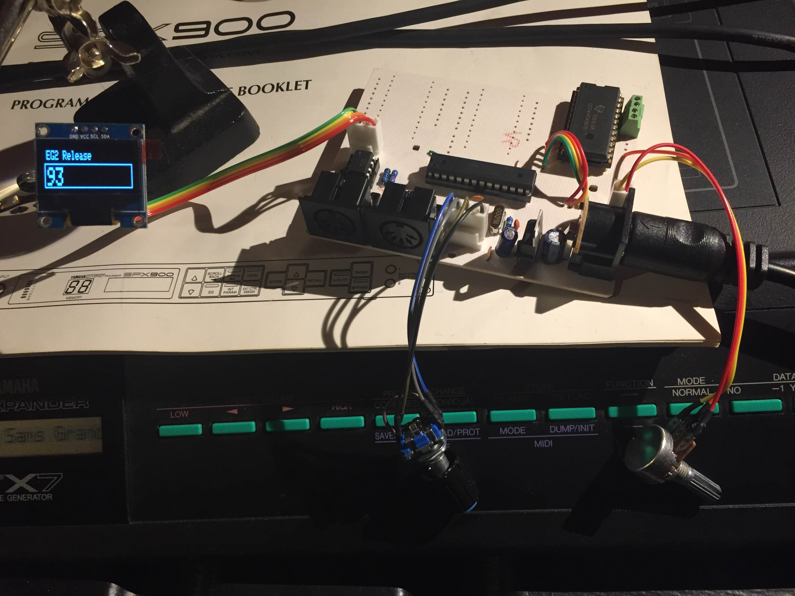

# PG328

Program your JX8P/JX10/MKS70 with sliders or MIDI Sysex with this Atmega328 based PG800 variation.

A .96" OLED screen shows the status and parameter values and a rotary encoder with momentary push switch provides full PG800 interface capabilities.

Status:

* 12/3/16: Stable control with encoder. Hold button to rotate parameter or just rotate to change value. Hold button down three seconds to assign slider of highest value to the current parameter.

