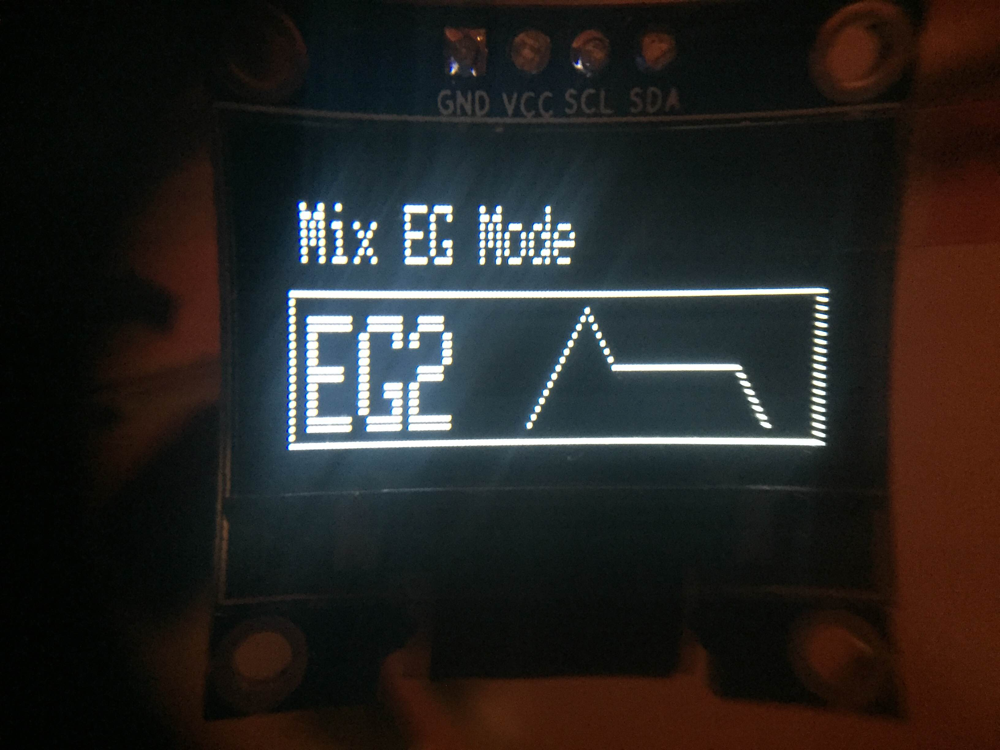
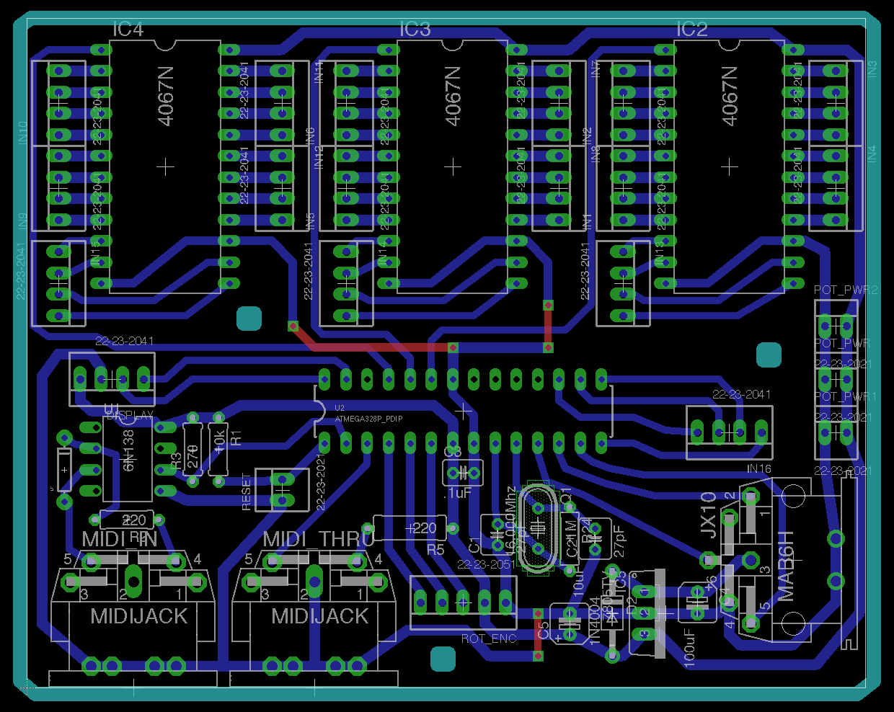

# PG328

Program your JX8P/JX10/MKS70 with sliders or MIDI Sysex with this Atmega328 based PG800 variation.

A .96" OLED screen shows the status and parameter values and a rotary encoder with momentary push switch provides full PG800 interface capabilities.

### MID SYSEX

#### Prefix: 

* 0x41 // manufacturer ID
* 0x36 // IPR mode
* 0x01 // device ID
* 0x24 // (from MKS70)
* 0x20 // (from MKS70)

#### Suffix:

* 0x01 // Tone

* 0x0F: Reset potentiometer assignments.

### Status:

* 2/24/17: 8-slider pcb tested. This verifies that lots of sliders can work together and will serve as ADSR for EG1 and 2.

* 12/9/16: All Parameters select and display values according to their type. Some even have lil icons...

* 12/7/16: New Sysex message to clear all pot assignments

* 12/3/16: Stable control with encoder. Hold button to rotate parameter or just rotate to change value. Hold button down three seconds to assign slider of highest value to the current parameter.

